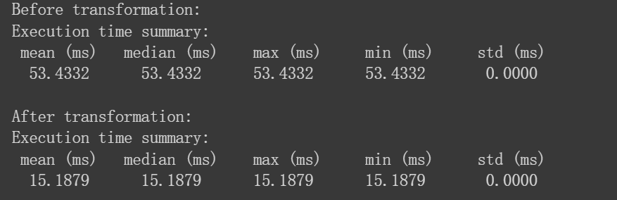

- [MLC: Machine Learning Compiler (TVM)](#mlc-machine-learning-compiler-tvm)
  - [Chapter 2 TensorIR](#chapter-2-tensorir)
    - [TensorIR 基础概念](#tensorir-基础概念)
    - [TensorIR_Practice.ipynb](#tensorir_practiceipynb)
      - [TVM 广播加法](#tvm-广播加法)
      - [TVM 二维卷积](#tvm-二维卷积)
      - [TVM 变换批量矩阵乘法](#tvm-变换批量矩阵乘法)
  - [Chapter 3 IRModule](#chapter-3-irmodule)
    - [IRModule.ipynb](#irmoduleipynb)
    - [MLC_HW_01.ipynb](#mlc_hw_01ipynb)
      - [从Torch 迁移一个小模型](#从torch-迁移一个小模型)
      - [混合torch 和 topi 构建模型](#混合torch-和-topi-构建模型)
      - [Schedule](#schedule)
  - [Chapter 4 自动程序优化](#chapter-4-自动程序优化)
    - [Automatic_Program_Optimization.ipynb](#automatic_program_optimizationipynb)
  - [Chapter 5 与机器学习框架整合](#chapter-5-与机器学习框架整合)
    - [Integration_with_MLF.ipynb](#integration_with_mlfipynb)

# MLC: Machine Learning Compiler (TVM)

- 深度学习编译器实践

- 陈天奇主讲的MLC课程:
    - https://mlc.ai/summer22-zh/
    - https://github.com/mlc-ai/mlc-zh


## Chapter 2 TensorIR

### TensorIR 基础概念

两种构建TensorIR的方法：
- TVMSript
- Tensor Expression
   
TensorIR抽象
- 函数参数 与 缓冲区 `T.buffer[(dim0, dim1), "dtype"]`
- For 循环迭代      `for i, j, l in T.grid(128, 128, 128)`
- 计算块    
  - `T.block("Buffer")`
  -  块轴的属性：spaital， reduce
  -  块轴绑定的语法糖 `vi, vj, vk = T.axis.remap("SSR", [i, j, k])`
- 函数属性 和 装饰器
  - ` T.func_attr({"global_symbol": "mm_relu", "tir.noalias": True})`
  - `"global_symbol"` 对应函数名
  -   `"tir.noalias"` 表示缓冲区的存储器不重叠


### TensorIR_Practice.ipynb
#### TVM 广播加法

```python
@tvm.script.ir_module
class MyAdd:
  @T.prim_func
  def add(A:T.Buffer[(4,4), "int64"],
          B:T.Buffer[(4,), "int64"],
          C:T.Buffer[(4,4), "int64"]):
    T.func_attr({"global_symbol": "add", "tir.noalias": True})
    for i, j in T.grid(4,4):
        with T.block("C"):
          vi = T.axis.spatial(4, i)
          vj = T.axis.spatial(4, j)
          C[vi, vj] = A[vi, vj] + B[vj]
```

#### TVM 二维卷积
- 目前推荐TensorIR的`T.Buffer[]` 的参数 `shape` 写 `constant`(from 冯思远)


```python
N, CI, H, W, CO, K = 1, 1, 8, 8, 2, 3
OUT_H, OUT_W = H - K + 1, W - K + 1
data = np.arange(N*CI*H*W).reshape(N, CI, H, W)
weight = np.arange(CO*CI*K*K).reshape(CO, CI, K, K)
```
- 先写出numpy版本，更容易去参照着优化
```python
def convol_1(A: np.ndarray, B: np.ndarray, C: np.ndarray):
    for i in range(1): 
        for j in range(2):
          for k in range(6):
            for l in range(6):
              for m in range(3):
                for n in range(3):
                  C[i, j, k ,l] += A[i, i, k + m, l + n] * B[j, i, m, n]

```

```python

@tvm.script.ir_module
class MyConv:
  @T.prim_func
  def conv(A:T.Buffer[(1, 1, 8, 8),"int64"],
        B:T.Buffer[(2, 1, 3, 3),"int64"],
        C:T.Buffer[(1, 2, 6, 6),"int64"]):
    T.func_attr({"global_symbol": "conv", "tir.noalias": True})
    for i, j, k, l, m, n in T.grid(1, 2, 6, 6, 3, 3):
      with T.block("C"):
        vi, vj, vk, vl, vm, vn = T.axis.remap("SSSSRR",[i, j, k, l, m, n])
        with T.init():
          C[vi, vj, vk, vl]= T.int64(0)
        C[vi, vj, vk, vl] = C[vi, vj, vk, vl] + A[vi, vi, vk + vm, vl + vn] *  B[vj, vi, vm, vn]
```

#### TVM 变换批量矩阵乘法
>bmm_relu
- numpy版本
```python
def lnumpy_mm_relu_v2(A: np.ndarray, B: np.ndarray, C: np.ndarray):
    Y = np.empty((16, 128, 128), dtype="float32")
    for n in range(16):
        for i in range(128):
            for j in range(128):
                for k in range(128):
                    if k == 0:
                        Y[n, i, j] = 0
                    Y[n, i, j] = Y[n, i, j] + A[n, i, k] * B[n, k, j]
    for n in range(16):
        for i in range(128):
            for j in range(128):
                C[n, i, j] = max(Y[n, i, j], 0)
```
- TVM 版本
```python
@tvm.script.ir_module
class MyBmmRelu:
  @T.prim_func
  def bmm_relu(A: T.Buffer[(16, 128, 128), "float32"],
               B: T.Buffer[(16, 128, 128), "float32"],
               C: T.Buffer[(16, 128, 128), "float32"]):
    T.func_attr({"global_symbol": "bmm_relu", "tir.noalias": True})
    Y = T.alloc_buffer((16, 128, 128))
    for n ,i, j, k in T.grid(16, 128, 128, 128):
      with T.block("Y"):
        vn, vi, vj ,vk = T.axis.remap("SSSR", [n, i, j, k])
        with T.init():
            Y[vn, vi, vj] = T.float32(0)
        Y[vn, vi, vj] = Y[vn, vi, vj] + A[vn, vi ,vk] * B[vn, vk, vj]
    
    for n, i, j in T.grid(16, 128, 128):
      with T.block("C"):
        vn, vi ,vj = T.axis.remap("SSS", [n, i, j])
        C[vn, vi, vj]  = T.max(Y[vn, vi, vj], T.float32(0))
```
- 变换TensorRT
```python
sch = tvm.tir.Schedule(MyBmmRelu)
# Step 1. Get blocks 首先对Y进行拆解
Y = sch.get_block("Y", func_name="bmm_relu")
# Step 2. Get loops
n, i, j, k = sch.get_loops(Y)
# Step 3. Organize the loops 
j0, j1 = sch.split(j, factors = [None, 8])
sch.reorder(n, i, j0, k, j1)
n, i, j0, k, j1 = sch.get_loops(Y) 
sch.parallel(n)
C = sch.get_block("C", "bmm_relu")
sch.reverse_compute_at(C, j0)
# Step 4. decompose reduction 将初始化与规约分开
sch.decompose_reduction(Y, k)
# Step 5. vectorize / parallel / unroll
Y_init = sch.get_block("Y_init", "bmm_relu")
ax0_init = sch.get_loops(Y_init)
sch.vectorize(ax0_init[3])

C = sch.get_block("C", "bmm_relu")
ax0 = sch.get_loops(C)
sch.vectorize(ax0[3])

k0, k1 = sch.split(k, factors = [None, 4])
sch.unroll(k1)

```

```python
class TargetModule:
    @T.prim_func
    def bmm_relu(A: T.Buffer[(16, 128, 128), "float32"], B: T.Buffer[(16, 128, 128), "float32"], C: T.Buffer[(16, 128, 128), "float32"]) -> None:
        T.func_attr({"global_symbol": "bmm_relu", "tir.noalias": True})
        Y = T.alloc_buffer([16, 128, 128], dtype="float32")
        for i0 in T.parallel(16): # n = i0
            for i1, i2_0 in T.grid(128, 16): # i1 = i , j0 = i2_0
                #初始化Y 
                for ax0_init in T.vectorized(8):
                    with T.block("Y_init"):
                        n, i = T.axis.remap("SS", [i0, i1])
                        j = T.axis.spatial(128, i2_0 * 8 + ax0_init)
                        Y[n, i, j] = T.float32(0)
                #计算Y
                for ax1_0 in T.serial(32):  # [ax1_0,ax1_1] =[ 32 ,4] k 
                    for ax1_1 in T.unroll(4):
                        for ax0 in T.serial(8): # j1 = ax0
                            with T.block("Y_update"):
                                n, i = T.axis.remap("SS", [i0, i1])
                                j = T.axis.spatial(128, i2_0 * 8 + ax0)
                                k = T.axis.reduce(128, ax1_0 * 4 + ax1_1)
                                Y[n, i, j] = Y[n, i, j] + A[n, i, k] * B[n, k, j]
                #Relu计算
                for i2_1 in T.vectorized(8):
                    with T.block("C"):
                        n, i = T.axis.remap("SS", [i0, i1])
                        j = T.axis.spatial(128, i2_0 * 8 + i2_1)
                        C[n, i, j] = T.max(Y[n, i, j], T.float32(0))
```

- 实验结果


## Chapter 3 IRModule

### IRModule.ipynb
- 基于计算图进行优化，尽量将低层次代码抽象成计算图模式（吸取TF经验）
- 利用 `call_tir` 和 `dataflow block`
  - `call_tir`  完成对低层次函数的封装，构造成计算图模式
  - `dataflow block` 确定计算图优化区域
- IRModule 允许注册现有库函数，并且可以和自己写的`TensorIR`使用

### MLC_HW_01.ipynb

#### 从Torch 迁移一个小模型
- 利用 `emit_te` 将张量表达式转换为符合计算图标准的 `TensorIR`
  
```python

def conv2d_1(Input, fliter, bias):
  lv1_0 = tvm.topi.nn.conv2d(Input, fliter, 1, 0, 1)
  return tvm.topi.add(lv1_0, bias)
  
def relu_2(Input):
  tvm.topi.nn.pool2d
  return tvm.topi.nn.relu(Input)

def maxPool_3(Input):
  # return tvm.topi.nn.pool2d(Input, (2, 2), (0, 0) , 1, (0, 0, 0, 0), 'max', False, 'NHCW', False)
  return tvm.topi.nn.pool2d(data = Input, kernel = [2, 2], dilation = (1,1), stride = [2,2], padding = [0,0,0,0], pool_type = 'max')
   
def flatten_4(Input):
  return tvm.topi.nn.flatten(Input)

def linear_5(Input, weight, bias):
  lv5_0 = tvm.topi.nn.dense(Input, weight)
  return tvm.topi.add(lv5_0, bias) 
    
def relu_6(Input):
  return tvm.topi.nn.relu(Input)

def linear_7(Input, weight ,bias):
  lv7_0 = tvm.topi.nn.dense(Input, weight)
  return tvm.topi.add(lv7_0, bias) 

def softMax_8(Intput):
  return tvm.topi.nn.softmax(Intput, axis=- 1)

def create_model_via_emit_te():
    bb = relax.BlockBuilder()
    x = relax.Var("x", input_shape, relax.DynTensorType(batch_size, "float32"))

    conv2d_weight = relax.const(weight_map["conv2d_weight"], "float32")
    conv2d_bias = relax.const(weight_map["conv2d_bias"].reshape(1, 32, 1, 1), "float32")
    linear0_weight = relax.const(weight_map["linear0_weight"], "float32")
    linear0_bias = relax.const(weight_map["linear0_bias"].reshape(1, 100), "float32")
    linear1_weight = relax.const(weight_map["linear1_weight"], "float32")
    linear1_bias = relax.const(weight_map["linear1_bias"].reshape(1, 10), "float32")

    with bb.function("main", [x]):
        with bb.dataflow():
          lv1 = bb.emit_te(conv2d_1, x, conv2d_weight, conv2d_bias)
          lv2 = bb.emit_te(relu_2, lv1)
          lv3 = bb.emit_te(maxPool_3, lv2)
          lv4 = bb.emit_te(flatten_4, lv3)
          lv5 = bb.emit_te(linear_5, lv4, linear0_weight, linear0_bias)
          lv6 = bb.emit_te(relu_6, lv5)
          lv7 = bb.emit_te(linear_7, lv6, linear1_weight, linear1_bias)
          lv8 = bb.emit_te(softMax_8, lv7)

          gv = bb.emit_output(lv8)
        bb.emit_func_output(gv)

    return bb.get()
mod = create_model_via_emit_te()
IPython.display.HTML(code2html(mod.script()))
```

#### 混合torch 和 topi 构建模型

```python
@tvm.register_func("env.conv2d", override=True)
def torch_conv2d(
    x: tvm.nd.NDArray,
    w: tvm.nd.NDArray,
    out : tvm.nd.NDArray
):
    x_torch = torch.from_dlpack(x)
    w_torch = torch.from_dlpack(w)
    out_torch = torch.from_dlpack(out)
    t = torch.nn.functional.conv2d(x_torch, w_torch)
    out_torch.copy_(t)

lv1_0 = bb.emit(relax.op.call_tir(relax.extern("env.conv2d"), (x, conv2d_weight),(4, 32, 26, 26), dtype="float32"))
```


#### Schedule

```python
mod = create_model_via_emit_te_4()
sch = tvm.tir.Schedule(mod)
# Step 1. Get blocks

# Step 2. Inline the padding block (if exists)
pad_temp = sch.get_block("pad_temp", "conv2d_1")
sch.compute_inline(pad_temp)

# Step 3. Get loops
conv = sch.get_block("conv2d_nchw","conv2d_1")

# Step 4. Organize the loops
i0, i1, i2, i3, i4, i5, i6 = sch.get_loops(conv)

i0_0, i0_1 = sch.split(i0, factors=[2, 2])
i1_0, i1_1 = sch.split(i1, factors=[None, 4])
i2_0, i2_1 = sch.split(i2, factors=[None, 2])
i3_0, i3_1 = sch.split(i3, factors=[None, 2])
sch.reorder(i0_0, i1_0, i2_0, i3_0, i4, i5, i6, i0_1, i1_1, i2_1, i3_1)


i0_0, i1_0, i2_0, i3_0, i4, i5, i6, i0_1, i1_1, i2_1, i3_1 = sch.get_loops(conv)

sch.fuse(i0_0, i1_0, i2_0, i3_0)
i0_0_i1_0_i2_0_i3_0_fuse, i4, i5, i6, i0_1, i1_1, i2_1, i3_1 = sch.get_loops(conv)

sch.parallel(i0_0_i1_0_i2_0_i3_0_fuse)

sch.fuse(i0_1,i1_1)
sch.fuse(i2_1,i3_1)


i0_0_i1_0_i2_0_i3_0_fuse, i4, i5, i6, i0_1_i1_1_fused, i2_1_i3_1_fused = sch.get_loops(conv)
sch.unroll(i0_1_i1_1_fused)
sch.vectorize(i2_1_i3_1_fused)

sch.decompose_reduction(conv, i4)

```


## Chapter 4 自动程序优化

### Automatic_Program_Optimization.ipynb

- 随机变换帮助我们指定可能程序的搜索空间。
- Meta-Schedule 在搜索空间中搜索，并找到优化后的程序。
- 我们可以使用另一种变换，将初始的元张量函数替换为优化后的函数，并更新的端到端执行流程。


## Chapter 5 与机器学习框架整合

### Integration_with_MLF.ipynb

- torch的模型的图结构导出
- BlockBuilder 通过 emit_te 和其他函数创建IRModule
- 根据torch的图结构构造TVM的IRModule 实现与现有框架的整合
  